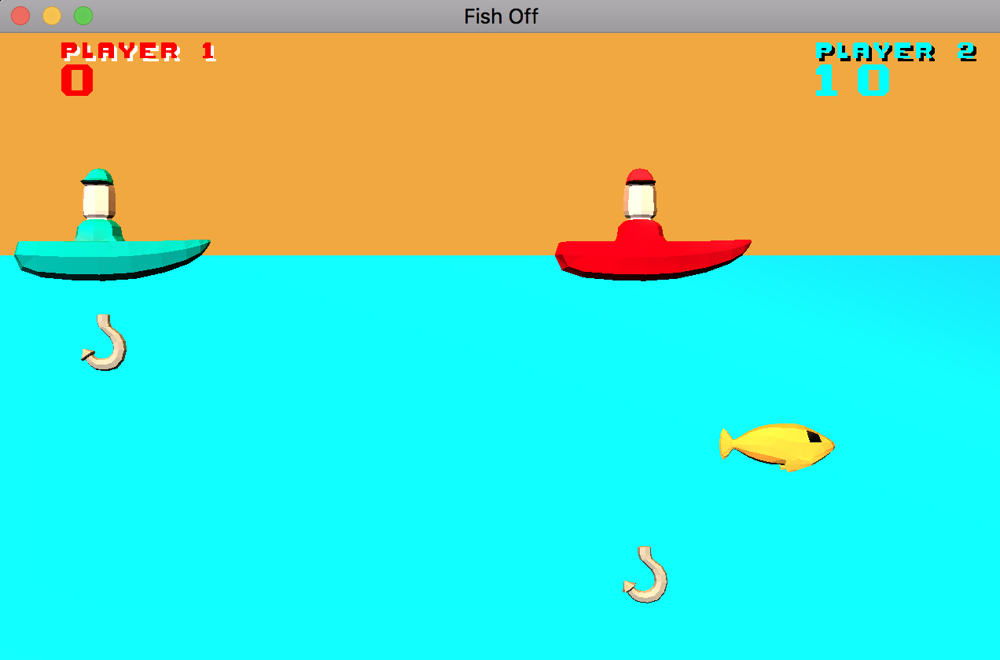

# Game Information

Title: Fish Off

Author: James Gualtieri

Design Document: [Fish Off](https://github.com/jamesgualtieri/game2-design)

Screen Shot:



How To Play:

Move the character left and right witht the mouse, move the fishing lure up and down using the W and S keys respectfully.

Changes From The Design Document:

I removed the crab hazard from the design document because I did not have the time to add it properly.

Good / Bad / Ugly Code:

I think I managed to use the server interface pretty well, not noticing any issues when running two instances of the game side by side. However, i don't think that the use of the Scene loading was done in the intended or in an interesting way, but hey, it works right?


## Asset Build Instructions

The ```meshes/export-meshes.py``` script can write mesh data including a variety of attributes (e.g., *p*ositions, *n*ormals, *c*olors, *t*excoords) from a selected layer of a blend file:

```
blender --background --python meshes/export-meshes.py -- meshes/crates.blend:1 dist/crates.pnc
```

The ```meshes/export-scene.py``` script can write the transformation hierarchy of the scene from a selected layer of a blend file, and includes references to meshes (by name):

```
blender --background --python meshes/export-scene.py -- meshes/crates.blend:1 dist/crates.scene
```

The ```meshes/export-walkmeshes.py``` script can writes vertices, normals, and triangle indicies of all meshes on a selected layer of a .blend file:

```
blender --background --python meshes/export-walkmeshes.py -- meshes/crates.blend:3 dist/crates.walkmesh
```

There is a Makefile in the ```meshes``` directory with some example commands of this sort in it as well.

## Runtime Build Instructions

The runtime code has been set up to be built with [FT Jam](https://www.freetype.org/jam/).

### Getting Jam

For more information on Jam, see the [Jam Documentation](https://www.perforce.com/documentation/jam-documentation) page at Perforce, which includes both reference documentation and a getting started guide.

On unixish OSs, Jam is available from your package manager:
```
	brew install ftjam #on OSX
	apt get ftjam #on Debian-ish Linux
```

On Windows, you can get a binary [from sourceforge](https://sourceforge.net/projects/freetype/files/ftjam/2.5.2/ftjam-2.5.2-win32.zip/download),
and put it somewhere in your `%PATH%`.
(Possibly: also set the `JAM_TOOLSET` variable to `VISUALC`.)

### Libraries

This code uses the [libSDL](https://www.libsdl.org/) library to create an OpenGL context, and the [glm](https://glm.g-truc.net) library for OpenGL-friendly matrix/vector types.
On MacOS and Linux, the code should work out-of-the-box if if you have these installed through your package manager.

If you are compiling on Windows or don't want to install these libraries globally there are pre-built library packages available in the
[kit-libs-linux](https://github.com/ixchow/kit-libs-linux),
[kit-libs-osx](https://github.com/ixchow/kit-libs-osx),
and [kit-libs-win](https://github.com/ixchow/kit-libs-win) repositories.
Simply clone into a subfolder and the build should work.

### Building

Open a terminal (or ```x64 Native Tools Command Prompt for VS 2017``` on Windows), change to the directory containing this code, and type:

```
jam
```

That's it. You can use ```jam -jN``` to run ```N``` parallel jobs if you'd like; ```jam -q``` to instruct jam to quit after the first error; ```jam -dx``` to show commands being executed; or ```jam main.o``` to build a specific file (in this case, main.cpp).  ```jam -h``` will print help on additional options.

The jam command builds two executables, a ```server``` and a ```client``` executable in the ```/dist/``` directory.

The server executable usage is as follows: 
```./server <port>```
with a proper port number

The client executable usage is as follows: 
```./client <host> <port>```
with a proper host (where the server is runnint) and port number (e.g. running on same computer can be done by using `localhost`)
